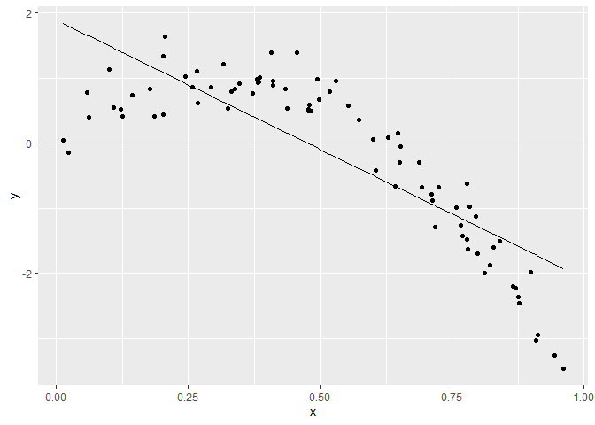

Cross Validation
================
Jenna Mohammed
2023-11-14

underfitting - we need stuff in our model to make it work overfitting
extra stuff just making noise

### implementing cross validation

add_predictions() and add_residuals() rmse() crossv_msc()

``` r
library(tidyverse)
```

    ## Warning: package 'tidyverse' was built under R version 4.1.3

    ## Warning: package 'tibble' was built under R version 4.1.3

    ## Warning: package 'tidyr' was built under R version 4.1.3

    ## Warning: package 'readr' was built under R version 4.1.3

    ## Warning: package 'purrr' was built under R version 4.1.3

    ## Warning: package 'dplyr' was built under R version 4.1.3

    ## Warning: package 'stringr' was built under R version 4.1.3

    ## Warning: package 'forcats' was built under R version 4.1.3

    ## Warning: package 'lubridate' was built under R version 4.1.3

    ## -- Attaching core tidyverse packages ------------------------ tidyverse 2.0.0 --
    ## v dplyr     1.1.2     v readr     2.1.4
    ## v forcats   1.0.0     v stringr   1.5.0
    ## v ggplot2   3.4.3     v tibble    3.2.1
    ## v lubridate 1.9.2     v tidyr     1.3.0
    ## v purrr     1.0.1     
    ## -- Conflicts ------------------------------------------ tidyverse_conflicts() --
    ## x dplyr::filter() masks stats::filter()
    ## x dplyr::lag()    masks stats::lag()
    ## i Use the conflicted package (<http://conflicted.r-lib.org/>) to force all conflicts to become errors

``` r
library(modelr)
```

    ## Warning: package 'modelr' was built under R version 4.1.3

``` r
library(mgcv)
```

    ## Warning: package 'mgcv' was built under R version 4.1.3

    ## Loading required package: nlme
    ## 
    ## Attaching package: 'nlme'
    ## 
    ## The following object is masked from 'package:dplyr':
    ## 
    ##     collapse
    ## 
    ## This is mgcv 1.8-42. For overview type 'help("mgcv-package")'.

``` r
set.seed(1)
```

## Nonlinear data and CV

``` r
nonlin_df = 
  tibble(
    id = 1:100,
    x = runif(100, 0, 1),
    y = 1 - 10 * (x - .3) ^ 2 + rnorm(100, 0, .3)
  )
# what this dataset looks like 

nonlin_df |> 
  ggplot(aes(x = x, y = y)) + 
  geom_point()
```

<!-- -->

try to pick between different models that might work and see which has
the best prediction accuracy

- do the train/test split

``` r
train_df = sample_n(nonlin_df, 80)

# ^ subject 8 is not included in this dataset 

test_df = anti_join(nonlin_df, train_df, by = "id")

# ^ subject 8 DOES show up

ggplot(train_df, aes(x = x, y = y)) + 
  geom_point() + 
  geom_point(data = test_df, color = "red")
```

<!-- -->

``` r
linear_mod = lm(y ~ x, data = train_df)

smooth_mod = mgcv::gam(y ~ s(x), data = train_df)
#^ gam function; give me a smooth function of x and use this to create the model

wiggly_mod = mgcv::gam(y ~ s(x, k = 30), sp = 10e-6, data = train_df)
```

quick visualization of the linear model

``` r
train_df |>
  modelr::add_predictions(linear_mod) |>
  ggplot(aes( x=x, y=y)) +
  geom_point() +
  geom_line(aes( y = pred))
```

<!-- -->

``` r
#^ not a good fit, just a straight line through the data 

train_df |>
  modelr::add_predictions(smooth_mod) |>
  ggplot(aes( x=x, y=y)) +
  geom_point() +
  geom_line(aes( y = pred))
```

<!-- -->

``` r
# ^ offers a smooth curve thrugh the data points; used he game function in above code chunk

train_df |>
  modelr::add_predictions(wiggly_mod) |>
  ggplot(aes( x=x, y=y)) +
  geom_point() +
  geom_line(aes( y = pred))
```

<!-- -->

lowest residual standard deviation

``` r
rmse(linear_mod, train_df)
```

    ## [1] 0.7178747

``` r
rmse(smooth_mod, train_df)
```

    ## [1] 0.2874834

``` r
rmse(wiggly_mod, train_df)
```

    ## [1] 0.2498309

``` r
rmse(linear_mod, test_df)
```

    ## [1] 0.7052956

``` r
rmse(smooth_mod, test_df)
```

    ## [1] 0.2221774

``` r
rmse(wiggly_mod, test_df)
```

    ## [1] 0.289051

^ RMSE on testing data gives a sense of out of sample prediction
accuracy!
